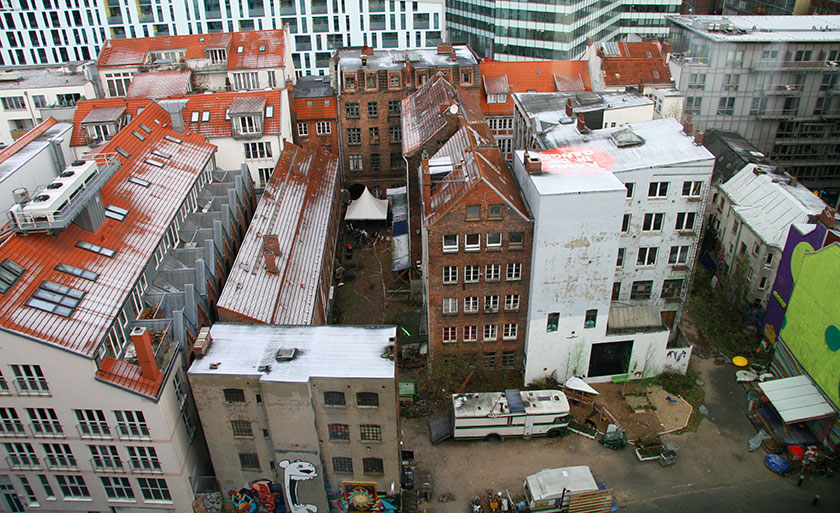
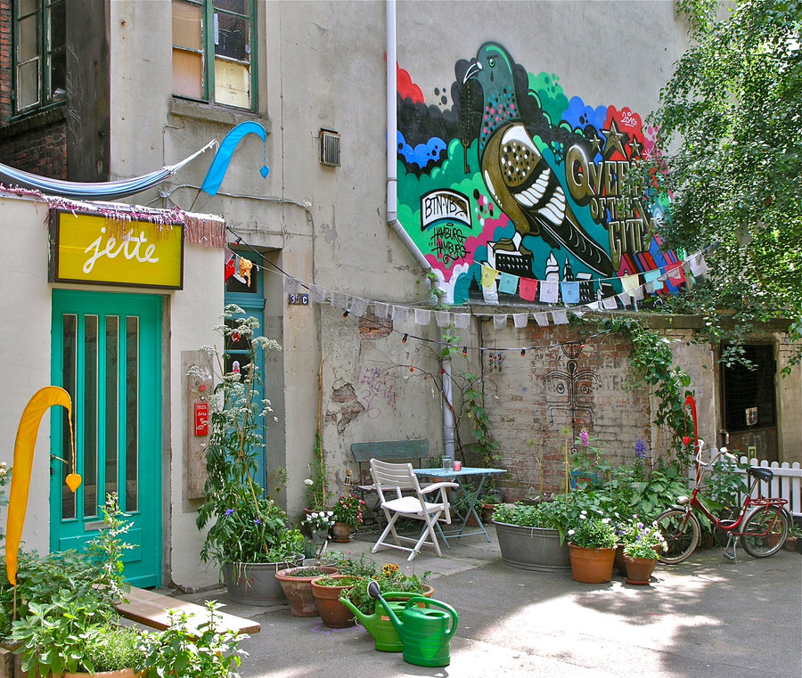

**Mix's perspective through conversations and observation over 24 hours** (2015, September 30)

[http://das-gaengeviertel.info/](http://das-gaengeviertel.info/)

It's broken down using a test framework assuming that organisations are like organisms, and they both have : 

- Selection pressures (which drive change)
- Structures
- Adaptive mechanisms

---

Selection pressures
===================

Named values
------------

- constructive invitational protest (includes a way to invite people in, creates oppertunity to say 'yes'.
  - "we occupy the gaengeviertel to protect the heritage, but we fill every room with an art exhibition and open it to the public. Afterwards we move in but the is enough positive sentiment that nobody comes to kick us out."
  - "when they rennovate the front of the building, they put proective fences up. When they took them down we immediately put up a small fence and garden to extend the cafe. It's a nice public space, and so far no-one has said anything."
  - "in germany a bike has can be anything up to the size of a car, and can be powered as long as it has a max speed of 25kph. We put a lawn on our cargo bike, kind of as a joke, so we can make a lawn anywhere. Next we're going to make a room that you can move anywhere, it's going to be 2x3m ( -numbers based on mix's memory)"
- Trust and sharing
- Autonomy
- Hearing all people
- Artist residencies + conscious cycling of residents
- residents all contribute to upkeep + growth 
  - 5 hours per week
  - rent (goes to saving pool for future collective-driven rennovatoin)

Emergent values 
---------------

- the group has a pattern of re-discussing decissions when someone was not present
- accountability/ reliability around lending objects seems like a challenge

The lending thing seems like it might have eroded some trust and people seem to feel like they would have to spend personal capital / energy to come to a solution. e.g. : 
  - Till lends tools and they often come back broken. He now buys loaning tools he doesn't use that are cheaper and just gets people to replace those when they break them.
  - Daniel says no to people borrowing projecters for personal use 90% of the time. When he does loan these community projectors out they come back broken.
  - Asma (?) loans her bike to people and they lose it. She finds it and when they ask again she has a conversation where she tries to put more rules in, but doesn't like that dynamic.
All three acknowledge that this dynamic might lead to more beauracracy, more locked doors, more rules, and less trust.

Having said that, people in general like to share a lot within Gaengeviertel (everything is voluntary work based for example), there is also an "acceptance of loss" that is necessary in large collectives

External relationships
----------------

- close working relationship with local municipality
  - recently negotiated to take over administration role of several of the rennovated gaengeviertal buildings from municipality
  - municipality imposes architect and style guide for rennovation that has stripped some character. not very much consulting on that.

Structure
=========

Decision making
---------------

- weekly general assembly
  - periodic (weekly)
  - time-box (7-9pm)
  - majority rules
  - note-taker: decisions captured ('protocols') and emailed to everyone after meeting
  - facilitator (volunteer)
  - speaking stack
  - re-litigating: hot topics sometimes re-opened and re-decided when people weren't at last meeting and feel strongly (this is frustrating/ sometimes unfair)
  - guests welcome, can vote

Roles
-----

- service role 
  - new people are commonly invite to work in the cafe/ bar, which enables everyone to meet more easily (

- a Pate (spelling? literally 'godfather')
  - each new person supported by one 

- 'coffee club'
  - if something is going really bad someone can go and have a last attempt to resolve problems by inviting a person discuss over coffe. This is the last chance and is quite serious. Very rare.
  - members are to be picked by the main assembly

- work groups 
  - permanent
  - responsible for specific things 
  - examples :  
    - communication
    - negotiation with the municipality
    - programming
    - for each house's self-administration
    - building-issues
    - finances
    - for the main assembly
  - all meet frequently, meetings are open to newcomers

Organisation
------------

Two registered legal bodies: one housing association (administrting and later owning the houses) and one programming association (running the program within the houses)

Adaptive mechanisms
===================

- general assembly
  - can propose changes here
  - can re-discuss any decisions that anyone missed (suggestion this might be too much flexibility)

- janurary is internal work
  - Every Janurary just do internal work (don't do exhibitions / courses). This is when a lot of internal work gets done (on processes and physical space).

---

---

notes from general assembly meeting 
===================================

Context: Some important decisions got made last week, so not that many people present. A lot of negotiation over administration of the newly renovated houses. Now they own, and we administer.

The meeting is in german, so I only have little notes from Till, and observation of *how* people are talking.

called: General Assembly (vollversammlung). 
Every week: wednesday at 7pm

people start arriving and catching up and grab a drink.
there are 23 people (apparently this is low).

Meeting flow:
-------------

Start: it's 7.35 pm 
Till gets attention, starts meeting. 

### Checkin round

The door remains open, there's a checkin round about feelings, apparently there are a lot of guests.

Mix introduces himself during the mood checkin round ... Till bridges to introduction round.

### Introduction round

Artist resident introduces herself ?

(**Till**: New people get a person assigned to them from gaengeviertel)
(people are are sitting mostly in a circle, but there are 2-3 people behind the bar, and one person in the corner)

People listen during the introductions, there are a couple of questions of new people.
Till interupts conversation to clarify.

3-4 people come in during introductions.
People are mostly 20-30 years old.
There are only ~4 people that look older than 40, all males.

### Announcements round

**there's no-one taking notes yet**

Popcorn announcements (apparently just whoever has something to say). Someone sitting directly behind me outside of the circle makes an announcement, there's some follow up comments, laughter.

An past art intern announces a gift of artwork to the space. applause, response. 
Till responds, moves to collecting more people to speak

Someone next to me asks quietly about whether I'm doing the protocol (I later discover this means note-taking of decisions)
There's some discussion about laptop then paper given to someone else who is writing.

Till re-clarifies the speaking order.

Someone presents something
There's some follow up from people
2-3 Some people chat and laugh about something unrelated
Till clarifies whether the topic is done. It is, we move on

Someone presents something. 
Till makes an information crarification.
People yelling to grab control from facilitator from the corner of the room, 2-3 people talking over each other.

Seems there's a person taking paper notes now. Want to know what's in them. (Later discover it's a record of decisions, and that working groups are permanent structures)

Till interupts original speak, moves topic along.

People signal they want to talk with a single word/ a hand up. Sometimes they just talk in response.

Second instance of Till trying to guide conversation then two people talking over him. voices raised.
People seem anxious to be heard and have space.
In a pause in conversation Till re-asserts speaking order.

Follow-up questions 
-------------------

[answers from Till in *italics*]

- How are meeting roles allocated? 
  - *- by volunteering at the start*
- Seems there's a person taking paper notes now. Want to know what's in them, and whether they go online. 
  - *- notes of decisions made, they get emailed out to everyone*
- Why did the person yell in form the corner of the meeting 
  - *- because they wanted to finish what they're saying, because they have important work to be done. They have announced their info multiple times, but are worried some people don't have the info yet*
- Is there an expectation of meeting length? Do people get exhausted? 
  - *- it runs from ~7pm to 9pm so that it's not too long*
- What's the average dinner time for people and do people eat before the meeting on average? 
  - *- the meeting is at 7pm so people who work can come. people generally eat later*
- Do you present the agenda to new people? 
  - *- Usually the agenda is communicated a day before the main assembly over the mailing list*
- Do people know the method of interupting? 
  - *- Interrupting is actually considered not to be cool, nontheless people keep doing it, when they have the feeling of not being heard enough*
- I want to know whether Till as facilitator is differentiating his roles clearly, or only performing one. 
  - *- good question wink emoticon Actually the main assembly you attended was one of the few that were not prepared, usually the facilitator is decided a week before the next meeting and can prepare better*
- Why are people sitting outside the circle ? 
  - *-Their own choice. Why do people not come to meetings, has anyone asked them? A few people are pretty self-centered artists that don't attend meetings. The large majority of other people comes frequently, especially as soon as there is important topics to decide*

